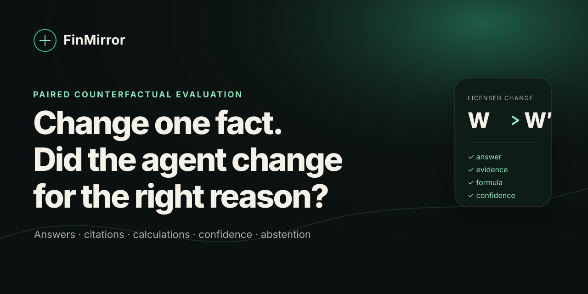
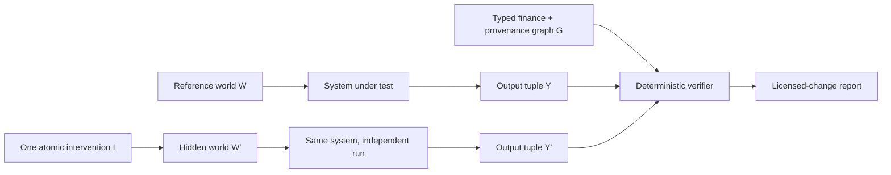

<p align="center">
  
</p>

<p align="center">
  <a href="https://facewang753.github.io/finmirror/"><strong>Live demo</strong></a> ·
  <a href="https://huggingface.co/datasets/mingyang233/FinMirror"><strong>Hugging Face dataset</strong></a> ·
  <a href="#quickstart">Quickstart</a> ·
  <a href="docs/METHODOLOGY.md">Methodology</a> ·
  <a href="docs/LITERATURE_REVIEW.md">47-paper review</a> ·
  <a href="docs/DATA_CARD.md">Data card</a> ·
  <a href="CONTRIBUTING.md">Contribute</a>
</p>

# FinMirror

**Change one financial fact. Did the agent change for the right reason?**

FinMirror is a provider-neutral evaluation harness for financial RAG systems and
agents. It runs a system independently in hidden paired evidence worlds, then checks
whether the complete verifiable output moved as the evidence graph permits:

- a material operand changes → answer, citation, operand, and calculation must change;
- a distractor, peer entity, stale period, or injected instruction changes → the answer
  must remain stable while citations still migrate to the current world;
- required evidence disappears → the system must abstain, lower confidence, and identify
  the exact missing evidence;
- the language changes → the financial result must remain semantically consistent.

No LLM judge is required for the v0.1 core. Numeric answers, canonical units, minimum
sufficient evidence, allow-listed finance programs, operand provenance, confidence
behavior, abstention, retrieval telemetry, and cross-language consistency are scored
deterministically.

> FinMirror is an evaluation project, not a trading system, regulatory certification,
> or source of investment advice.

## Why another finance benchmark?

Pointwise accuracy can reward the wrong mechanism. In the included offline demo, an
evidence-blind system memorizes the reference answer and still reaches **71.4% case
accuracy**. FinMirror gives it **0% strict pair reliability** because it cannot update on
material evidence, replay a formula, ground operands, or abstain after evidence removal.

| Offline system | Uses hidden gold? | Case accuracy | Strict pair reliability | Audit score | Gate |
|---|---:|---:|---:|---:|---:|
| Harness oracle | Yes — test only | 100.0% | 100.0% | 100.0 | Pass |
| Evidence program | No | 100.0% | 100.0% | 100.0 | Pass |
| Evidence-blind memorizer | No | 71.4% | 0.0% | 49.5 | Blocked |

These are deterministic harness checks on synthetic v0.1—not claims about any hosted
model. Reproduce them with `finmirror demo`.

**[Explore the zero-key interactive demo →](https://facewang753.github.io/finmirror/)**

The exact public v0.1 data package is also mirrored on
[Hugging Face](https://huggingface.co/datasets/mingyang233/FinMirror), including the
manifest and input/output JSON Schemas. The evaluator and scoring contract remain
versioned in this repository.

## Independent upstream integrations

FinMirror enters other projects through reproducibility contributions, not benchmark
name-dropping. The public [integration review ledger](audits/README.md) separates
source-level preflights from executed audits and publishes pinned revisions,
reproduction commands, capability gaps, upstream PRs, and explicit requests for
maintainer correction.

The first completed preflight covers
[FinSight-AI at `54ca3ac`](audits/finsight-ai/preflight-54ca3ac.md). Its ordered
evidence-snapshot hash was [merged upstream in PR #14](https://github.com/juanjuandog/FinSight-AI/pull/14)
as commit [`d2b9b60`](https://github.com/juanjuandog/FinSight-AI/commit/d2b9b6043135e6863eaf8b84457b2cdec71539e6).
The preflight still publishes no reliability score because the project does not yet expose
a fair frozen-corpus seam; a merged reproducibility primitive is not a reliability endorsement.

## Quickstart

Python 3.10–3.12 is supported. The core has zero runtime dependencies.

```bash
python -m venv .venv
# Windows: .venv\Scripts\activate
# macOS/Linux: source .venv/bin/activate
python -m pip install -e ".[dev]"

finmirror generate
finmirror validate
finmirror demo
```

Open `artifacts/demo/index.html`. The report is a standalone local HTML file with no
telemetry, CDN, or external assets.

Run any system that emits the [prediction contract](docs/METHODOLOGY.md#submission-contract):

```bash
finmirror score \
  --predictions path/to/predictions.jsonl \
  --system "my-finance-agent" \
  --out runs/my-agent
```

Or run Cohere directly:

```bash
python -m pip install -e ".[cohere]"
export COHERE_API_KEY="..."

finmirror run \
  --adapter cohere \
  --model command-a-plus-05-2026 \
  --rerank-model rerank-v4.0-pro \
  --measure-pre-confidence \
  --out runs/cohere-command-a-plus
```

FinMirror embeds evidence into the structured-output prompt because Cohere structured
JSON and the `documents` parameter are not combined in this adapter. API calls cost
money; no hosted-model result is bundled or implied.

## The paired-world contract



The evaluated system never sees both worlds together. Pairing is evaluator-side, which
prevents a comparison prompt from revealing the intended difference.

The output tuple in v0.1 is:

```text
(answer, unit, citations, formula_id, operands, confidence,
 abstention, missing_evidence, retrieved_document_ids, trace)
```

The strict pair gate is conjunctive. A correct answer cannot compensate for stale
citations, ungrounded operands, invalid calculation replay, unjustified confidence, or a
reported retrieval miss.

## What ships in v0.1

- **126 cases / 108 paired interventions / 18 complete groups**
- **6 workflows:** revenue growth, gross margin, debt-to-equity, cash runway,
  covenant headroom, and free cash flow
- **3 languages:** authored English, French, and Chinese variants
- **6 interventions per reference:** material value, irrelevant distractor, entity
  collision, period collision, document prompt injection, and evidence ablation
- stable evidence anchors and SHA-256 dataset manifests
- exact formula-program replay and operand-level provenance
- Brier score, ECE, optional pre/post confidence, and pairwise confidence deltas
- optional retrieval IDs and preserved execution traces
- deterministic reward vectors and DPO-style preference export
- annotation agreement and Cohen’s κ utilities
- Cohere Command A+ / Rerank 4 adapter
- standalone interactive reliability cards

All companies and evidence in v0.1 are fictional. This avoids silent redistribution of
issuer-authored filings and makes every intervention fully auditable.

## Research position

FinMirror is informed by—not a relabeling of—recent work:

| Work | What it already establishes | FinMirror’s narrower contribution |
|---|---|---|
| [FinVerBench](https://arxiv.org/abs/2605.29586) (2026) | Observable financial-statement perturbations and clean false positives | Full RAG output behavior across separately run paired worlds |
| [RFC-Bench](https://aclanthology.org/2026.acl-long.492/) (ACL 2026) | Original–perturbed financial news pairs | Hidden system runs, provenance migration, calculation, and calibration |
| [GBFR](https://aclanthology.org/2026.acl-long.1273/) (ACL 2026) | Metric-graph calculation and counterfactual abstention | Bidirectional sensitivity *and* specificity across the output tuple |
| [CALIBER](https://arxiv.org/abs/2606.24281) (Cohere, 2026) | Confidence before vs. after reasoning | Confidence behavior under controlled evidence interventions |
| [Soft-SVeRL](https://arxiv.org/abs/2605.28561) (Cohere, 2026) | Soft, checklist-based verifiable rewards | Deterministic hard gates plus exportable reward vectors |
| [FinRAG-12B](https://aclanthology.org/2026.acl-industry.92/) (ACL 2026) | Production answer/citation/refusal training | Differential tests that pointwise production KPIs can miss |

The complete [literature review](docs/LITERATURE_REVIEW.md) covers 47 papers and marks
preprints separately from peer-reviewed proceedings. We do **not** claim the first
financial counterfactual, multilingual finance, visual-citation RAG, financial agent, or
verifiable-finance benchmark.

A deliberately scoped research claim is:

> To our knowledge, FinMirror is the first benchmark designed to test whether a
> financial RAG or agent’s structured answer, evidence, calculation, confidence, and
> abstention behavior change exactly along licensed causal and provenance paths under
> hidden paired document interventions.

This is a v0.1 hypothesis, not an established fact. It must be re-checked against the
literature immediately before any paper submission.

## Repository map

```text
benchmark/v0.1/       Reproducible synthetic paired worlds + manifest
src/finmirror/        Contracts, verifier, adapters, CLI, reports, exports
tests/                Unit, integration, tamper, and regression tests
artifacts/demo/       Reproducible offline reliability cards
schema/               JSON Schemas for cases and predictions
docs/                 Methodology, data card, literature, roadmap, launch kit
```

## Roadmap to a publishable benchmark

Synthetic v0.1 proves the protocol and software, not real-world validity. The next
research release is designed around:

1. expert-validated, observable interventions over legally redistributable or
   fetch-by-manifest financial sources;
2. typed XBRL/filing dependency graphs and frozen + rolling contamination-limited tracks;
3. multi-document, multilingual, visual, restatement, and strict `as_of` tasks;
4. tool-budget, latency, and replayable agent-trajectory gates;
5. bootstrap confidence intervals, inter-annotator agreement, and verifier
   meta-evaluation;
6. sealed isomorphic relations to measure reward hacking and benchmark gaming.

See the [research roadmap](docs/RESEARCH_ROADMAP.md) for milestones and stop/go criteria.

### Experimental v0.2 source controls

The repository now includes a fail-closed
[source provenance ledger](docs/PROVENANCE_LEDGER.md) and
[calibration-slice protocol](docs/V0.2_PROTOCOL.md) for future real-source work. The
committed rows are **candidates**, not released benchmark data: they have no captured
content hashes or completed rights review and are deliberately rejected by the release
gate. Synthetic v0.1 remains the only scored dataset.

The hash-bound [evidence manifest](sources/v0.2/evidence-manifest.json) also makes that
claim boundary executable. It distinguishes synthetic artifacts, byte-exact provider
captures, deterministic source-derived renders, and evaluator-authored counterfactuals.
Run:

```bash
finmirror evidence-status
finmirror evidence-status --require-real-source  # deliberately fails today
```

The first command verifies the committed artifact bytes and reports `SYNTHETIC_ONLY`.
The second is a fail-closed release gate: it cannot pass until a rights-reviewed source
receipt reaches an evaluator-visible derived artifact. Even then, the result would
establish source lineage only, not expert validation or real-world representativeness.

## Contributing

The fastest high-impact contributions are a provider adapter, a new auditable finance
program, a minimal paired-world template, or a verifier adversarial test. Read
[CONTRIBUTING.md](CONTRIBUTING.md) before opening a change.

Code is Apache-2.0. The authored synthetic benchmark is CC BY 4.0; see
[DATA_LICENSE.md](DATA_LICENSE.md). Please cite the project with [CITATION.cff](CITATION.cff).
