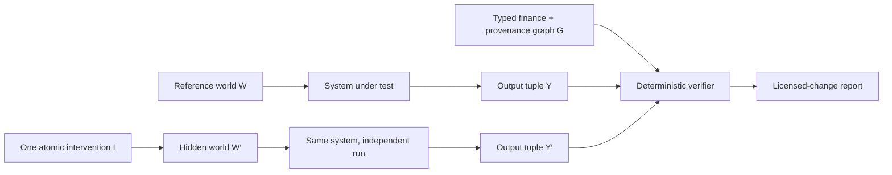

<p align="center">
  
</p>

<p align="center">
  <a href="https://facewang753.github.io/finmirror/"><strong>Live demo</strong></a> ·
  <a href="https://huggingface.co/datasets/mingyang233/FinMirror"><strong>Hugging Face dataset</strong></a> ·
  <a href="#quickstart">Quickstart</a> ·
  <a href="docs/EQUIVALENCE_ASSURANCE.md">Equivalence assurance</a> ·
  <a href="docs/AGENT_TRACE_AUDIT.md">Agent trace audit</a> ·
  <a href="docs/RERANK_ASSURANCE.md">Rerank assurance</a> ·
  <a href="docs/JUDGE_ASSURANCE.md">Judge assurance</a> ·
  <a href="docs/METHODOLOGY.md">Methodology</a> ·
  <a href="docs/EVERY_EVAL_EVER.md">EEE export</a> ·
  <a href="docs/LITERATURE_REVIEW.md">56-paper review</a> ·
  <a href="docs/DATA_CARD.md">Data card</a> ·
  <a href="CONTRIBUTING.md">Contribute</a>
</p>

# FinMirror

**Change one financial fact. Did the agent change for the right reason?**

FinMirror is a provider-neutral evaluation harness for financial RAG systems and
agents. It runs a system independently in hidden paired evidence worlds, then checks
whether the complete verifiable output moved as the evidence graph permits:

- a material operand changes → answer, citation, operand, and calculation must change;
- a distractor, peer entity, stale period, or injected instruction changes → the answer
  must remain stable while citations still migrate to the current world;
- required evidence disappears → the system must abstain, lower confidence, and identify
  the exact missing evidence;
- the language changes → the financial result must remain semantically consistent.

No LLM judge is required for the v0.1 core. Numeric answers, canonical units, minimum
sufficient evidence, allow-listed finance programs, operand provenance, confidence
behavior, abstention, retrieval telemetry, and cross-language consistency are scored
deterministically.

> FinMirror is an evaluation project, not a trading system, regulatory certification,
> or source of investment advice.

## Why another finance benchmark?

Pointwise accuracy can reward the wrong mechanism. In the included offline demo, an
evidence-blind system memorizes the reference answer and still reaches **71.4% case
accuracy**. FinMirror gives it **0% strict pair reliability** because it cannot update on
material evidence, replay a formula, ground operands, or abstain after evidence removal.

| Offline system | Uses hidden gold? | Case accuracy | Strict pair reliability | Audit score | Gate |
|---|---:|---:|---:|---:|---:|
| Harness oracle | Yes — test only | 100.0% | 100.0% | 100.0 | Pass |
| Evidence program | No | 100.0% | 100.0% | 100.0 | Pass |
| Evidence-blind memorizer | No | 71.4% | 0.0% | 49.5 | Blocked |

These are deterministic harness checks on synthetic v0.1—not claims about any hosted
model. Reproduce them with `finmirror demo`.

**[Explore the zero-key interactive demo →](https://facewang753.github.io/finmirror/)**

### Measured local open-model baselines

The controls above test the evaluator and are deliberately separated from measured
model runs. The following results come from real, fixed GGUF artifacts running locally
through the same public contract on the 42-case English slice (36 pairs). Neither model
saw hidden gold at inference time.

| Measured model | Cases | Case accuracy | Full verification | Strict pair reliability | Audit score | Gate |
|---|---:|---:|---:|---:|---:|---:|
| [Qwen2.5 1.5B Instruct Q4_K_M](artifacts/model-baselines/qwen2.5-1.5b-q4_k_m-en/RUN.md) | 42 | 11.9% | 0.0% | 0.0% | 8.6 | Blocked |
| [Qwen3 4B Q4_K_M](artifacts/model-baselines/qwen3-4b-q4_k_m-en/RUN.md) | 42 | 73.8% | 0.0% | 0.0% | 36.5 | Blocked |

The Qwen3 run gets 31/42 point answers correct and every response parses, but none is
fully verified and none of 36 paired relations passes. These are single deterministic
runs on synthetic English data, not model rankings or evidence of production,
regulatory, multilingual, or investment performance. Each linked bundle includes the
predictions, canonical JSON/HTML report, model/runtime receipt, hashes, and reproduction
commands.

## Agent paths: correct is not yet verifiable

FinMirror v0.2 adds deterministic replay for observable agent evidence paths. A
canonical `read_document` event binds the exact document observation to a SHA-256
receipt. The auditor then checks that retrieval claims, citations, operands, and the
terminal formula or abstention all descend from verified reads.

```bash
finmirror trace-demo
```

The zero-key falsification demo keeps all 126 final predictions byte-identical and
removes only their trace. Both variants retain **100% answer accuracy**; verified-path
pass rate falls from **100% to 0%**. This demonstrates that path verification is
orthogonal to answer correctness—it is not a result for any hosted model.

**[Open the live replayable trace demo →](https://facewang753.github.io/finmirror/trace/)**

See the [trace contract, failure taxonomy, and threat model](docs/AGENT_TRACE_AUDIT.md).
The audit checks observable replay consistency, not hidden chain-of-thought or causal
attribution, and its receipts are content-addressed rather than tamper-resistant
signatures.

## Before generation: did retrieval expose the wrong passage first?

FinMirror derives an anchor-level retrieval packet from all 126 paired evidence worlds
and audits whether a ranker surfaces the complete minimum evidence set before a wrong-
entity, stale-period, injected, or other harmful passage.

```bash
finmirror retrieval-demo
```

The committed [retrieval assurance report](https://facewang753.github.io/finmirror/retrieval/)
is deployed with the main zero-key demo, and CI regenerates it before accepting changes.

The zero-key demo includes a gold-aware harness oracle, a lexical baseline, and a
deliberately brittle input-order control. The oracle is structurally barred from passing
the public gate; real rankers must return complete, evidence-blind rankings. Read the
[metrics, JSONL contract, claim boundary, and literature links](docs/RERANK_ASSURANCE.md).
Synthetic results do not establish production retrieval quality or Cohere model
performance.

The exact public v0.1 data package is also mirrored on
[Hugging Face](https://huggingface.co/datasets/mingyang233/FinMirror), including the
manifest and input/output JSON Schemas. The evaluator and scoring contract remain
versioned in this repository.

## Judge the judge: checklist quality before reward

Checklist-based learned verifiers can produce useful dense signals while hiding two
different defects: a bad decomposition and an overly permissive judgment. FinMirror's
zero-network judge assurance separates them, then applies atomic-omission, irrelevant-
context, and requirement-reorder metamorphic tests.

```bash
finmirror judge-demo
```

The bundled controls hold oracle requirement states constant across an atomic calibrated
verifier, an atomic but permissive verifier, and a collapsed permissive verifier. Only
the first passes the declared release gate. The audit is inspired by publicly documented
Soft-SVeRL failure modes; it is an independent engineering extension, not a reproduction
or an affiliated result. [Open the judge-assurance demo](https://facewang753.github.io/finmirror/judge/)
or read the [method and threat model](docs/JUDGE_ASSURANCE.md).

## Independent upstream integrations

FinMirror enters other projects through reproducibility contributions, not benchmark
name-dropping. The public [integration review ledger](audits/README.md) separates
source-level preflights from executed audits and publishes pinned revisions,
reproduction commands, capability gaps, upstream PRs, and explicit requests for
maintainer correction.

The first completed preflight covers
[FinSight-AI at `54ca3ac`](audits/finsight-ai/preflight-54ca3ac.md). Its ordered
evidence-snapshot hash was [merged upstream in PR #14](https://github.com/juanjuandog/FinSight-AI/pull/14)
as commit [`d2b9b60`](https://github.com/juanjuandog/FinSight-AI/commit/d2b9b6043135e6863eaf8b84457b2cdec71539e6).
The preflight still publishes no reliability score because the project does not yet expose
a fair frozen-corpus seam; a merged reproducibility primitive is not a reliability endorsement.

## Evaluator assurance

A deterministic scorer is useful only if its own failures are inspectable. FinMirror now
runs a [15-class one-field mutation matrix](docs/EVALUATOR_ASSURANCE.md) against the
non-gold evidence-program baseline. It independently corrupts answer value, unit,
citations, formula, operand semantics/value/unit/provenance, confidence, abstention,
missing evidence, reported retrieval, and within-tolerance cross-language semantics.

```bash
finmirror assure-evaluator
```

The command fails closed unless every mutation produces its exact declared case-level
failure, pair-component failure, and cross-language effect. The committed
[machine-readable result](artifacts/evaluator-assurance.json) is bound to the dataset
digest and its [JSON Schema](schema/evaluator-assurance.schema.json). Passing this suite
is regression evidence for these declared mutations—not formal verification, expert
validation, or evidence that every scorer defect has been found.

### The dual gate: valid representations must remain valid

Mutation detection alone can reward an evaluator that rejects too much. FinMirror also
runs a [10-relation positive equivalence matrix](docs/EQUIVALENCE_ASSURANCE.md) over
citation and operand order, set idempotence, numeric serialization, unit case, display
whitespace, and irrelevant telemetry.

```bash
finmirror assure-equivalence
```

The committed run preserves **3,426/3,426 semantic assertions** across case scores,
semantic keys, affected pairs, and parallel-language groups. A deliberately brittle raw-
contract equality control rejects all 10 valid relations, showing that the audit is not
passing unchanged fixtures. [Open the live assurance card](https://facewang753.github.io/finmirror/equivalence/)
or inspect its [JSON Schema](schema/equivalence-assurance.schema.json). The allow-list is
narrow by design; it is not proof of every financially equivalent expression.

## Every Eval Ever interoperability

FinMirror can export scored runs to the
[Every Eval Ever](https://github.com/mlcommons/every_eval_ever) 0.3.0 aggregate and
instance-level contracts. The exporter emits one JSONL row per sample and metric,
computes the required canonical sample hashes, binds the sidecar checksum into the
aggregate record, uses the datastore directory convention, and validates provenance
before writing anything.

```bash
finmirror export-eee \
  --dataset benchmark/v0.1 \
  --report runs/my-agent/report.json \
  --predictions runs/my-agent/predictions.jsonl \
  --model-id "<registry-verified-developer/model>" \
  --model-name "<reported model name>" \
  --developer "<registry-verified-developer>" \
  --evaluator-relationship third_party \
  --deployment-type externally_managed \
  --model-availability closed_weights \
  --inference-platform "<actual provider>" \
  --source-revision "<exact dataset revision>" \
  --out artifacts/eee
```

The command deliberately rejects oracle/gold-aware runs, dataset or prediction
mismatches, ambiguous model paths, non-finite scores, and overwrites. It marks model
IDs unverified because registry resolution is a separate upstream review step; do not
submit an export until that ID and the declared deployment facts have been checked.
See the [EEE interoperability guide](docs/EVERY_EVAL_EVER.md).

## Quickstart

Python 3.10–3.12 is supported. The core has zero runtime dependencies.

### Install from source (available now)

FinMirror has not been published to PyPI yet. Clone the repository and install the
checked-out source so the command and benchmark artifacts come from the same revision:

```bash
git clone https://github.com/faceWang753/finmirror.git
cd finmirror
python -m venv .venv
# Windows: .venv\Scripts\activate
# macOS/Linux: source .venv/bin/activate
python -m pip install -e .

finmirror generate
finmirror validate
finmirror assure-evaluator
finmirror demo
finmirror trace-demo
finmirror judge-demo
```

Contributors can install the test and packaging tools with
`python -m pip install -e ".[dev]"`.

### PyPI installation (after the first verified release)

Once a versioned release is visible on the
[FinMirror PyPI project page](https://pypi.org/project/finmirror/), the supported package
installation path will be:

```bash
python -m pip install finmirror
```

Until that project page contains a release from this repository's Trusted Publishing
workflow, use the source installation above. No PyPI availability is currently implied.

Open `artifacts/demo/index.html`. The report is a standalone local HTML file with no
telemetry, CDN, or external assets.

Public, non-gold runs can be shared through the
[reproducible result form](https://github.com/faceWang753/finmirror/issues/new?template=result_submission.yml).

Run any system that emits the [prediction contract](docs/METHODOLOGY.md#submission-contract):

```bash
finmirror score \
  --predictions path/to/predictions.jsonl \
  --system "my-finance-agent" \
  --out runs/my-agent
```

Or run Cohere directly:

```bash
python -m pip install -e ".[cohere]"
export COHERE_API_KEY="..."

finmirror run \
  --adapter cohere \
  --model command-a-plus-05-2026 \
  --rerank-model rerank-v4.0-pro \
  --measure-pre-confidence \
  --out runs/cohere-command-a-plus
```

FinMirror embeds evidence into the structured-output prompt because Cohere structured
JSON and the `documents` parameter are not combined in this adapter. API calls cost
money; no hosted-model result is bundled or implied.

Run the same contract against an OpenAI-compatible chat-completions endpoint:

```bash
python -m pip install -e ".[openai]"
export OPENAI_BASE_URL="http://127.0.0.1:8000/v1"

finmirror run \
  --adapter openai \
  --model "<served-model-id>" \
  --base-url "$OPENAI_BASE_URL" \
  --out runs/local-compatible
```

Loopback endpoints can run without an API key. Remote endpoints require
`OPENAI_API_KEY`. The adapter uses strict JSON Schema through chat completions, records
bounded response metadata without raw prompts or secrets, and supports optional
pre-evidence confidence. Compatibility depends on the endpoint implementing
`response_format.type=json_schema`; no hosted-model result or performance claim is
bundled. See the [adapter guide](docs/ADAPTER_GUIDE.md#openai-compatible-endpoints).

### Use FinMirror as a pull-request gate

Systems that emit the prediction contract can run the strict paired-world gate directly
in GitHub Actions:

```yaml
- uses: faceWang753/finmirror@v0.2.0
  with:
    predictions: predictions.jsonl
    system: my-finance-agent
    system_version: ${{ github.sha }}
```

The action fails blocked evaluations, preserves JSON and standalone HTML reports, and
writes case accuracy, strict pair reliability, citation migration, operand provenance,
confidence behavior, evidence ablation, and the leading failures to the job summary.
See the complete [GitHub Actions guide](docs/GITHUB_ACTION.md).

## The paired-world contract



The evaluated system never sees both worlds together. Pairing is evaluator-side, which
prevents a comparison prompt from revealing the intended difference.

The output tuple in v0.1 is:

```text
(answer, unit, citations, formula_id, operands, confidence,
 abstention, missing_evidence, retrieved_document_ids, trace)
```

The strict pair gate is conjunctive. A correct answer cannot compensate for stale
citations, ungrounded operands, invalid calculation replay, unjustified confidence, or a
reported retrieval miss.

## What ships in v0.1

- **126 cases / 108 paired interventions / 18 complete groups**
- **6 workflows:** revenue growth, gross margin, debt-to-equity, cash runway,
  covenant headroom, and free cash flow
- **3 languages:** authored English, French, and Chinese variants
- **6 interventions per reference:** material value, irrelevant distractor, entity
  collision, period collision, document prompt injection, and evidence ablation
- stable evidence anchors and SHA-256 dataset manifests
- exact formula-program replay and operand-level provenance
- Brier score, ECE, optional pre/post confidence, and pairwise confidence deltas
- optional retrieval IDs and preserved execution traces
- deterministic reward vectors and DPO-style preference export
- strict Every Eval Ever 0.3.0 aggregate and instance-level export
- annotation agreement and Cohen’s κ utilities
- 15-class one-field evaluator mutation assurance with exact local failure attribution
- 10-class positive equivalence assurance with 3,426 invariant-score assertions
- Cohere Command A+ / Rerank 4 adapter
- standalone interactive reliability cards

All companies and evidence in v0.1 are fictional. This avoids silent redistribution of
issuer-authored filings and makes every intervention fully auditable.

## Research position

FinMirror is informed by—not a relabeling of—recent work:

| Work | What it already establishes | FinMirror’s narrower contribution |
|---|---|---|
| [FinVerBench](https://arxiv.org/abs/2605.29586) (2026) | Observable financial-statement perturbations and clean false positives | Full RAG output behavior across separately run paired worlds |
| [RFC-Bench](https://aclanthology.org/2026.acl-long.492/) (ACL 2026) | Original–perturbed financial news pairs | Hidden system runs, provenance migration, calculation, and calibration |
| [GBFR](https://aclanthology.org/2026.acl-long.1273/) (ACL 2026) | Metric-graph calculation and counterfactual abstention | Bidirectional sensitivity *and* specificity across the output tuple |
| [CALIBER](https://arxiv.org/abs/2606.24281) (Cohere, 2026) | Confidence before vs. after reasoning | Confidence behavior under controlled evidence interventions |
| [Soft-SVeRL](https://arxiv.org/abs/2605.28561) (Cohere, 2026) | Soft, checklist-based verifiable rewards | Deterministic hard gates plus exportable reward vectors |
| [FinRAG-12B](https://aclanthology.org/2026.acl-industry.92/) (ACL 2026) | Production answer/citation/refusal training | Differential tests that pointwise production KPIs can miss |
| [All Prompts Are Created Equal?](https://aclanthology.org/2026.findings-acl.1929/) (Findings ACL 2026) | Equivalent prompts can expose judge accuracy–robustness gaps | Digest-bound positive equivalence gates for the deterministic finance contract |

The [CIRCLE-to-FinMirror change-contract mapping](docs/CIRCLE_MAPPING.md) separately
shows how this harness could supply one automated observable inside a construct-centred
evaluation lifecycle. It is a component-level mapping inference, not an implementation
of CIRCLE, an endorsement, or evidence of stakeholder, field, or real-world validation.

The complete [literature review](docs/LITERATURE_REVIEW.md) covers 56 papers and marks
preprints separately from peer-reviewed proceedings. We do **not** claim the first
financial counterfactual, multilingual finance, visual-citation RAG, financial agent, or
verifiable-finance benchmark.

A deliberately scoped research claim is:

> To our knowledge, FinMirror is the first benchmark designed to test whether a
> financial RAG or agent’s structured answer, evidence, calculation, confidence, and
> abstention behavior change exactly along licensed causal and provenance paths under
> hidden paired document interventions.

This is a v0.1 hypothesis, not an established fact. It must be re-checked against the
literature immediately before any paper submission.

## Repository map

```text
benchmark/v0.1/       Reproducible synthetic paired worlds + manifest
src/finmirror/        Contracts, verifier, adapters, CLI, reports, exports
tests/                Unit, integration, mutation, tamper, and regression tests
artifacts/             Offline reliability cards + evaluator-assurance evidence
schema/                JSON Schemas for cases, predictions, assurance, equivalence, and traces
docs/                 Methodology, data card, literature, roadmap, launch kit
```

## Roadmap to a publishable benchmark

Synthetic v0.1 proves the protocol and software, not real-world validity. The next
research release is designed around:

1. expert-validated, observable interventions over legally redistributable or
   fetch-by-manifest financial sources;
2. typed XBRL/filing dependency graphs and frozen + rolling contamination-limited tracks;
3. multi-document, multilingual, visual, restatement, and strict `as_of` tasks;
4. tool-budget, latency, and replayable agent-trajectory gates;
5. bootstrap confidence intervals, inter-annotator agreement, and verifier
   meta-evaluation;
6. sealed isomorphic relations to measure reward hacking and benchmark gaming.

See the [research roadmap](docs/RESEARCH_ROADMAP.md) for milestones and stop/go criteria.

### Experimental v0.2 source controls

The repository now includes a fail-closed
[source provenance ledger](docs/PROVENANCE_LEDGER.md) and
[calibration-slice protocol](docs/V0.2_PROTOCOL.md). One Statistics Canada source is now
captured, rights-reviewed, and connected to a one-group calibration artifact; the Bank
of Canada row remains a blocked candidate. The calibration gold is provisional and has
not been independently reviewed. Synthetic v0.1 remains the only scored dataset.

The hash-bound [evidence manifest](sources/v0.2/evidence-manifest.json) also makes that
claim boundary executable. It distinguishes synthetic artifacts, byte-exact provider
captures, deterministic source-derived renders, and evaluator-authored counterfactuals.
Run:

```bash
finmirror evidence-status
finmirror evidence-status --require-real-source
finmirror review-status
finmirror validate-review --submission reviewer-alpha.jsonl
finmirror review-status --require-expert-validated  # deliberately fails today
```

The evidence commands verify the committed bytes and report
`RELEASE_READY_SOURCE_MATERIAL`: a rights-reviewed provider capture reaches a
source-derived reference and visibly disclosed counterfactuals. This establishes source
lineage only. The separate review command reports `PENDING_EXTERNAL_REVIEW`, and its
strict form blocks model runs or benchmark submissions until two independent
finance-capable annotations, blinded adjudication, agreement thresholds, and a matching
dataset digest are recorded.

**Finance reviewers wanted:** the bounded seven-case packet and independence rules are
in the [expert review guide](docs/EXPERT_REVIEW_PACKET.md). The
[account-free blind review app](https://facewang753.github.io/finmirror/review/) keeps
drafts in the reviewer's browser, loads no model output or provisional gold, and exports
digest-bound JSONL for local validation. Volunteers can use the
[structured review form](https://github.com/faceWang753/finmirror/issues/new?template=expert_review.yml)
without posting private credentials or employer-confidential information.

## Contributing

The fastest high-impact contributions are a provider adapter, a new auditable finance
program, a minimal paired-world template, or a verifier adversarial test. Read
[CONTRIBUTING.md](CONTRIBUTING.md) before opening a change.

Code is Apache-2.0. The authored synthetic benchmark is CC BY 4.0; see
[DATA_LICENSE.md](DATA_LICENSE.md). Please cite the project with [CITATION.cff](CITATION.cff).
